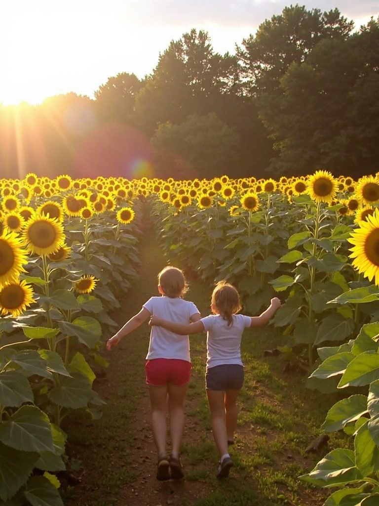
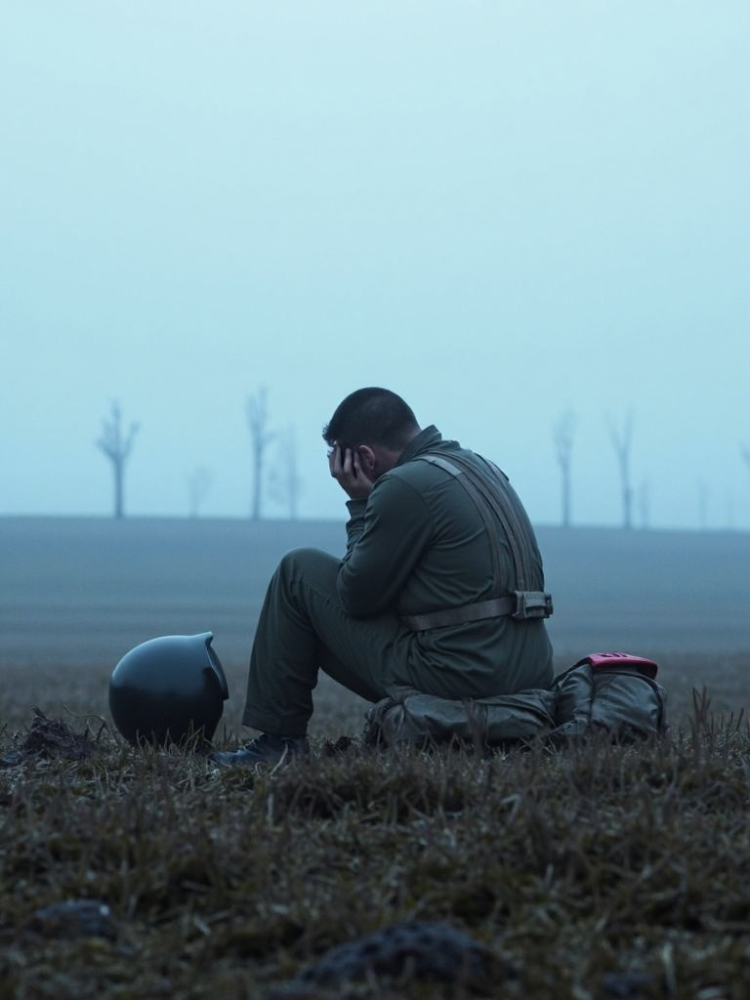
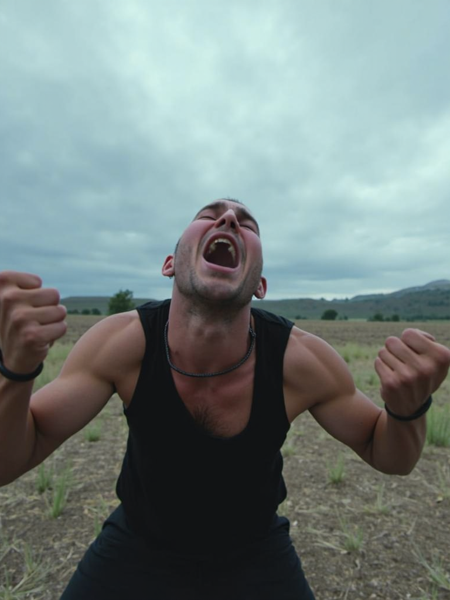
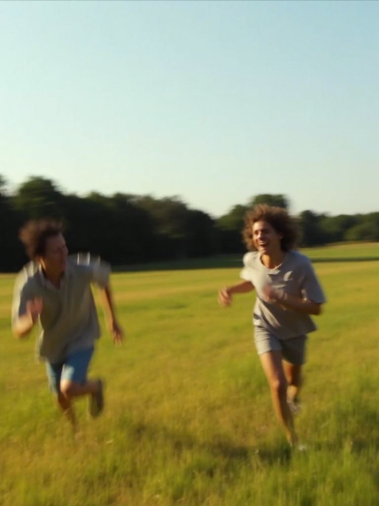
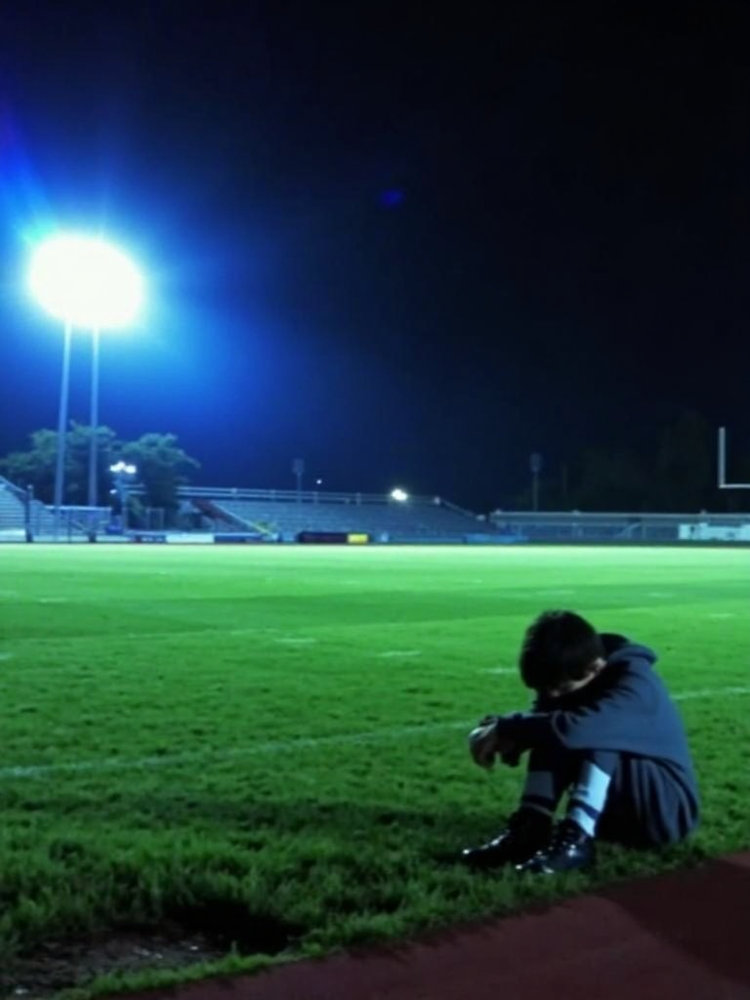

# Gallery

All images generated with Flux Studio using FLUX.1-dev + UltraRealistic Amateur V2 LoRA.
Settings: `dpmpp_2m` · `beta` scheduler · 40 steps · CFG 1 · Guidance 2.5 · LoRA strength 1.0 · 768×1024

---

### 1 — Desperate Run

```
Low-resolution, amateur photo shot on digital camera, no visible jpeg artifacts, slightly noisy,
a young man sprinting across a vast open wheat field at golden hour, shirt torn, barefoot,
motion blur on legs, panic in his eyes, storm clouds building behind him,
low angle tracking shot, warm front light cold back light split, documentary style
```


---

### 2 — Quiet Grief

```
Low-resolution, amateur photo shot on digital camera, slightly noisy,
a woman standing alone in a dead winter field, long coat, hands at her sides,
head slightly bowed, grey overcast sky stretching to the horizon,
cold flat light, silence, wide establishing shot, figure small against the emptiness
```


---

### 3 — Last Stand

```
dramatic cinematic lighting, film grain, shallow depth of field,
a man standing at the edge of an open field facing an incoming storm,
arms slightly spread, facing into violent wind, grass and debris flying horizontal,
backlit by green-yellow storm light, silhouette partially, defiant posture,
wide lens, epic and terrifying atmosphere
```


---

### 4 — Childhood Moment

```
Low-resolution, amateur photo shot on digital camera, slight jpeg artifacts, grainy,
two kids running through a sunflower field, laughing, arms out like wings,
late afternoon golden hour, lens flare, slightly overexposed highlights,
candid shot from behind, 1990s disposable camera feel
```



---

### 5 — Soldier's Pause

```
Low-resolution, amateur photo shot on digital camera, no visible jpeg artifacts, slightly noisy,
a soldier sitting alone in an open field, helmet beside him, head in his hands,
early morning fog, pale cold light, exhaustion and weight in every line of his posture,
medium shot, quiet devastation, documentary war photography aesthetic
```



---

### 6 — Rage in the Open

```
dramatic cinematic lighting, film grain,
a man screaming into the open sky in the middle of a barren field, fists clenched,
veins visible on neck, mouth wide open, overcast oppressive sky,
low angle looking up, wide lens distortion, raw and unhinged energy,
desaturated cold grade, brutal emotional weight
```



---

### 7 — Reunion

```
High-resolution photo, shot on a mobile phone, no visible artifacts, clear and sharp,
two people running toward each other across a green open field, one laughing one crying,
warm summer afternoon light, slight motion blur on both figures,
medium wide shot, genuine unposed emotion, golden grass in foreground bokeh
```



---

### 8 — Alone After the Fight

```
Low-resolution, amateur photo shot on digital camera, slightly noisy,
a teenager sitting in the middle of an empty football field after dark,
stadium lights off, single distant streetlight casting long shadows,
knees pulled to chest, head down, grass wet from rain,
cold blue atmosphere, isolation, handheld camera feel
```



---

> Prompts and workflow by [Uzair Mughal](https://uzair.is-a.dev) · LoRA by [Danrisi](https://civitai.com/models/796382)